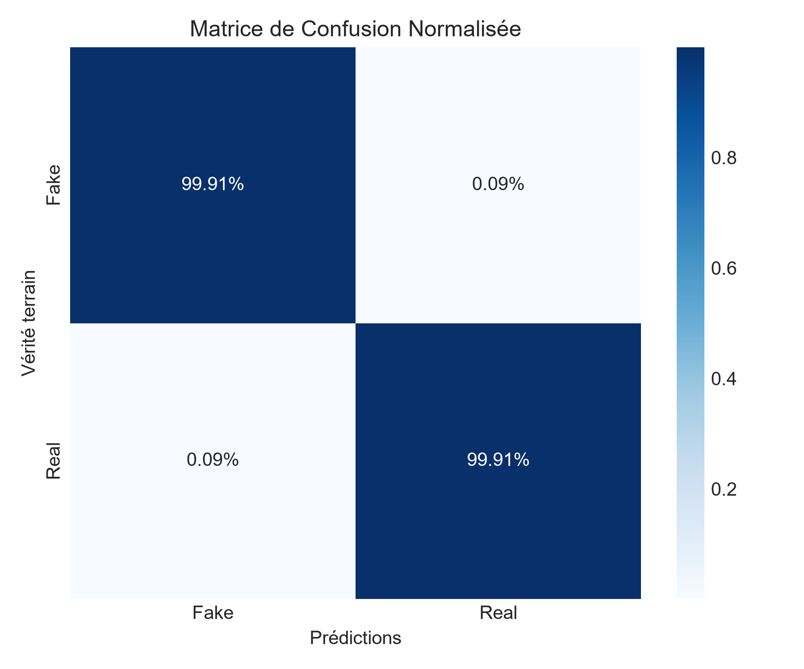

# Fake-news-dectection-using-Recurrent-Neural-Network
# 📰 Fake News Detection with Bidirectional LSTM

[](https://www.python.org/)
[](https://tensorflow.org/)
[](https://opensource.org/licenses/MIT)

Projet de Traitement Automatique du Langage Naturel (NLP) visant à classifier des articles d'actualité en tant que **vraies** ou **fausses** informations à l'aide d'un réseau de neurones récurrent (Bi-LSTM).

---

## 🎯 Aperçu du Projet

La propagation rapide de fausses informations représente un défi majeur dans l'écosystème numérique moderne. L'objectif de ce projet est de concevoir un pipeline de classification automatique de bout en bout capable de prédire l'authenticité d'un article à partir de son titre et de son contenu texte.

### Points Clés
- **Dataset** : ISOT Fake News Dataset (~45 000 articles étiquetés).
- **Prétraitement** : Nettoyage regex, normalisation textuelle et vectorisation native via `tf.keras.layers.TextVectorization`.
- **Modèle** : Architecture récurrente bidirectionnelle (Bi-LSTM) à 2 couches avec régularisation Dropout.
- **Visualisation des Embeddings** : Extraction des vecteurs appris compatible avec le [TensorFlow Embedding Projector](http://projector.tensorflow.org/).

---

## 📊 Performances

Le modèle est évalué sur un jeu de test indépendant représentant 20 % des données :

| Métrique | Score |
| :--- | :--- |
| **Accuracy** | **~99.0%** |
| **Precision** | **~98.8%** |
| **Recall** | **~99.2%** |

### Matrice de Confusion


---

## 🏗️ Architecture du Modèle

```
Input (Texte brut)
  │
  ▼
TextVectorization (Vocabulaire: 10 000 mots, Longueur max: 256 tokens)
  │
  ▼
Embedding (Dim: 128)
  │
  ▼
Bidirectional LSTM (64 unités, return_sequences=True)
  │
  ▼
Bidirectional LSTM (32 unités)
  │
  ▼
Dense (64 unités, activation='relu') + Dropout (0.5)
  │
  ▼
Dense (1 unité, activation='sigmoid') -> Probabilité [0, 1]
```

---

## 🚀 Installation & Utilisation

### 1. Cloner le projet
```bash
git clone [https://github.com/](https://github.com/)[VOTRE_PSEUDO]/fake-news-detection-rnn.git
cd fake-news-detection-rnn
```

### 2. Installer les dépendances
```bash
pip install -r requirements.txt
```

*(Exemple de `requirements.txt` : `tensorflow`, `pandas`, `numpy`, `scikit-learn`, `matplotlib`, `seaborn`)*

### 3. Télécharger les données
Placez les fichiers `Fake.csv` et `True.csv` (disponibles sur Kaggle / ISOT) dans le répertoire racine.

### 4. Lancer l'entraînement
```bash
python train_and_evaluate.py
```

---

## 🔍 Visualisation des Embeddings

Ce script génère automatiquement deux fichiers :
- `vecs.tsv` : contient les vecteurs de chaque mot.
- `meta.tsv` : contient les labels textuels correspondants.

Vous pouvez charger ces fichiers directement sur [projector.tensorflow.org](https://projector.tensorflow.org/) pour observer la séparation géométrique des champs lexicaux appris par le modèle.
